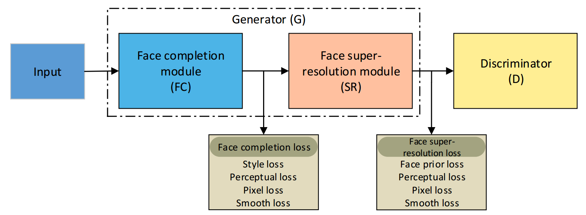
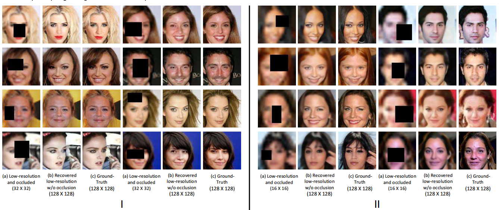

# FCSR-GAN

This is the source code for paper 

"FCSR-GAN: Joint Face Completion and Super-resolution via Multi-task Learning" </br>



## Experiment result



## Environment requirest

This code is based on Pytorch 0.4.1 and CUDA 8.0.

## Pre-processing 

All the faces are aligned using the [SeetaFace Engineer](https://github.com/seetaface/SeetaFaceEngine).

All the faces are parsed using the [GFC](https://github.com/Yijunmaverick/GenerativeFaceCompletion).

## Dataset
We use the standard train&test split of the [CelebA](http://mmlab.ie.cuhk.edu.hk/projects/CelebA.html) dataset.

## License

This project is released under the [Apache 2.0 license](LICENSE).


## Citation

If you find this work useful, please cite our papers with the following bibtex:


```
@article{FCSRGAN_TBIOM,
  title   = {{FCSR-GAN}: Joint Face Completion and Super-resolution via Multi-task Learning},
  author  = {Jiancheng, Cai and Hu, Han and Shiguang, Shan and Xilin, chen},
  journal= {IEEE Transactions on Biometrics, Behavior, and Identity Science},
  year={2019}
}

@article{FCSRGAN_FG,
  title   = {{FCSR-GAN}: End-to-end Learning for Joint Face Completion and Super-resolution},
  author  = {Jiancheng, Cai and Hu, Han and Shiguang, Shan and Xilin, chen},
  title = {FCSR-GAN: End-to-end learning for joint face completion and super-resolution},
  booktitle = {Proc. IEEE FG},
  pages = {1--8}, 
  year = 2019
}

```
